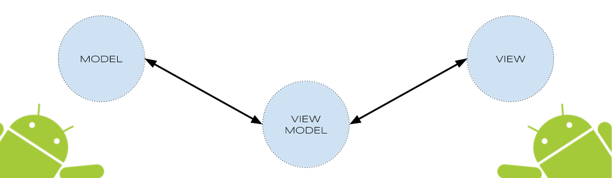

# catalog-app
 App for game catalog

## kotlin MVVM Compose

MVVM(Model View ViewModel) ejemplo en Kotlin usando los componentes : ViewModel, LiveData, las bibliotecas Retrofit, Glide y Mockito para pruebas unitarias.

### MVVM Pattern (Model View ViewModel)
 

### Demo

MVVM + Compose + Hilt + Room

Se usó Clean Architecture sin capa de dominio debido a simplicidad del requerimineto incial. pero que se puede implementar si se requiriera.

Los datos se almacenan en la primera carga, luego todas las consultas son realizadas a la base de datos local.
Se usó Paging para realizar el listado inicial en pantalla. Las demás consultas como ver Detalle de un Juego se realiza consultando a la pase de datos y usando UiState del ViewModel

Hay varios usos que se pueden dar a este enfoque, por ejemplo puede realizarse un sistema de sincronización bidireccional para mantener actualizada la base de datos remota, aspectos que no cubre este ejemplo, pero que se pueden implementar con facilidad.

### Dependencies

- Retrofit 2 [version: '2.11.0'](https://square.github.io/retrofit/)
- Coil [version: '2.6.0'](https://github.com/coil-kt/coil)

### References

- ViewModel https://developer.android.com/topic/libraries/architecture/viewmodel
- Paging https://developer.android.com/topic/libraries/architecture/paging/v3-overview
- Android Architecture Blueprints https://github.com/googlesamples/android-architecture
- Android Jetpack: ViewModel https://www.youtube.com/watch?v=5qlIPTDE274
- Mockk https://mockk.io/
- Turbine https://github.com/cashapp/turbine